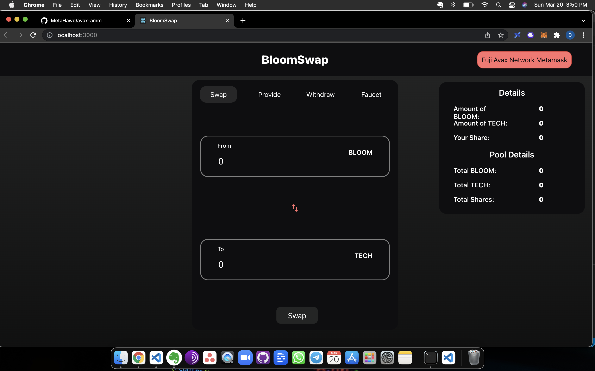
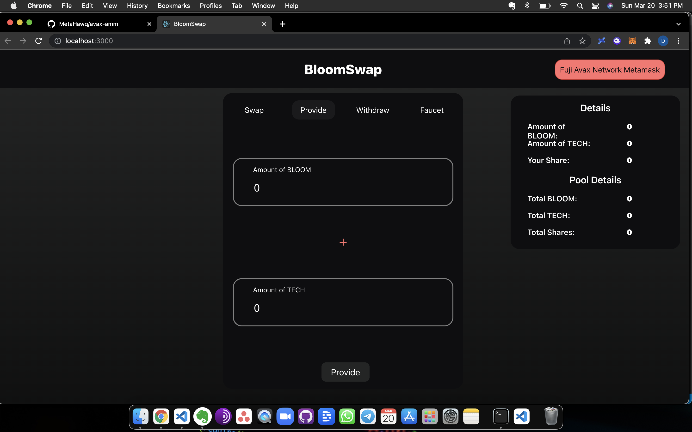
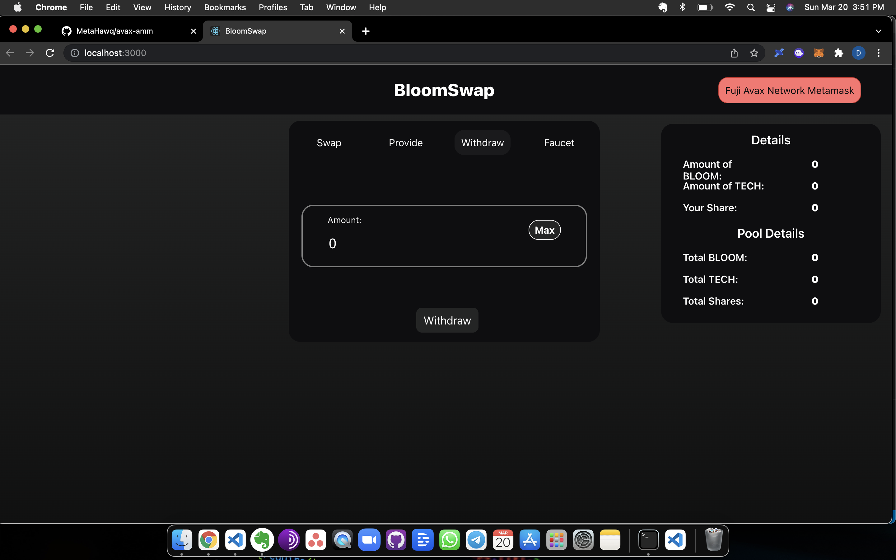
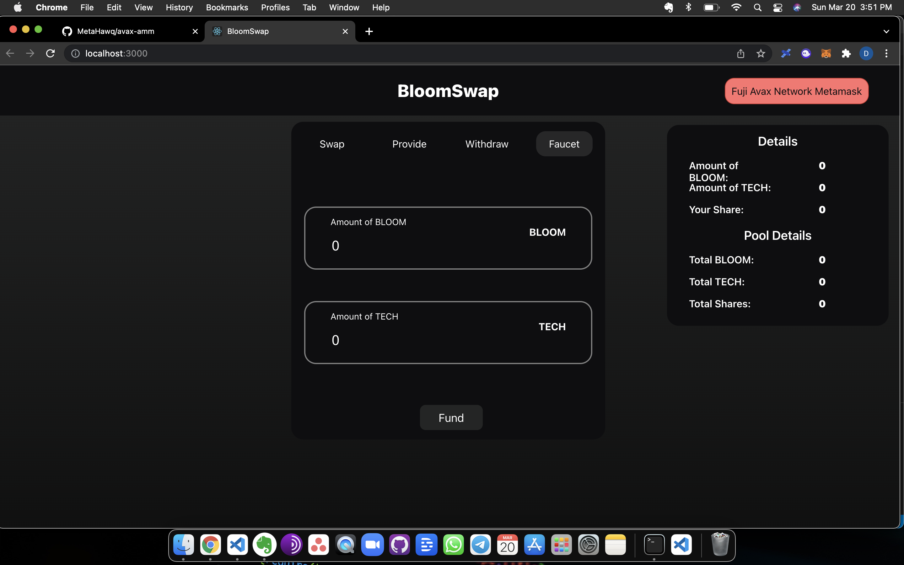

# amm on avax fuji testnet

Steps to run the application in your local machine:-
* Clone this repo:
```text
git clone https://github.com/MetaHawq/avax-amm.git
```
* Move in the `avax-amm` directory and install all the dependencies:
```text
npm install
```
* Run the application:
```text
npm start
```

-

-

-

